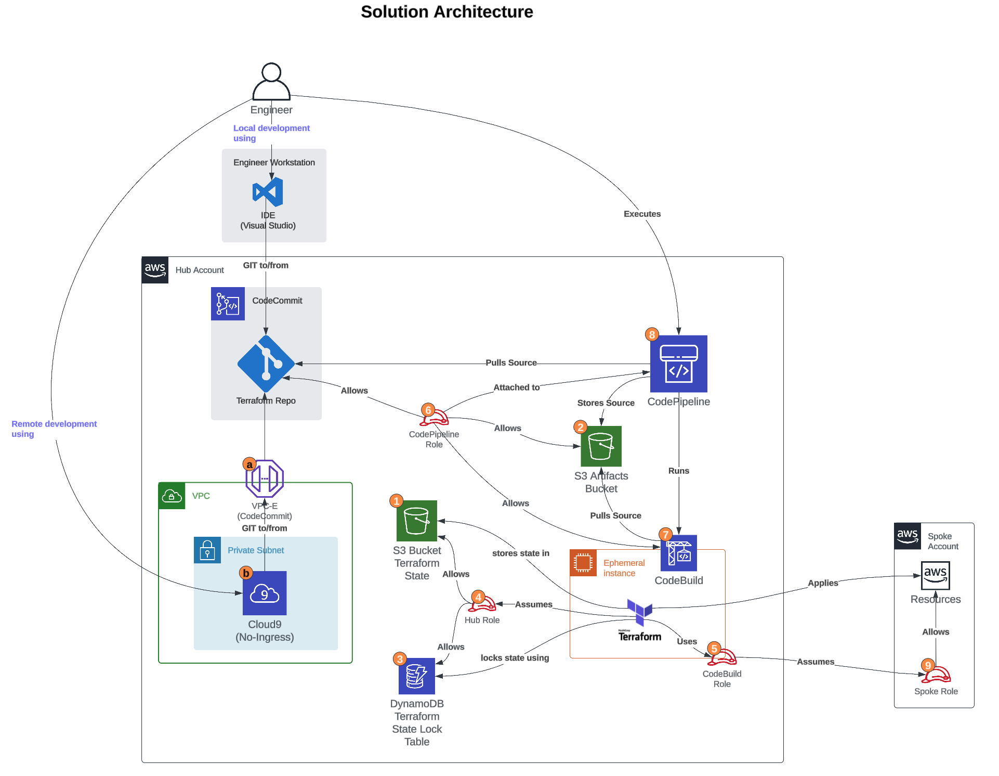

# Terraform AWS Pipeline Setup

## Overview
This document outlines the step-by-step process for deploying AWS resources using Terraform, AWS CodeBuild, and AWS CodePipeline across multiple accounts using a Hub and Spoke model. The process involves setting up CI/CD pipelines for automation, 
managing Terraform state files securely, and ensuring cross-account deployments through IAM roles.

## Diagrams

## Pre-requisites
- Access to Hub/Spoke accounts via the AWS Management Console.
- An IDE or script editor such as NotePad++, Visual Studio Code, or AWS Cloud9 for modifying Terraform and CloudFormation files.
- Git installed and configured

## Steps

### (Optional) Deploy No-Ingress Cloud9 Environment
If you would rather opt for a remote environment from which to perform Git and script editing mentioned in steps below, please follow these instructions, otherwise, skip and move on to Step 0. The Cloud9 environment includes the Cloud9 IDE, Git, AWS CLI, and the ability to install any other software you may want/need. 
- Navigate to the repository directory and locate the Cloud9 CloudFormation template: `<repo>/cloudformation/cloud9-setup.yml`.
- Deploy the this stack in a centralized (Hub) AWS account.
- Once the Cloud9 environment has been created, navigate to the Cloud9 console to access it. 

### 0. Clone This Repository
- Clone this repo to your own repo.
- The following steps assume that your are working off your own clone of this repository.

### 1. Repository Checkout
- Perform a Git fetch and pull to retrieve the repository that contains the CloudFormation and Terraform scripts.

### 2. Deploy Hub Stack
- The Hub Stack will deploy the following resources: 
  - S3 Bucket for Terraform State files
  - S3 Bucket for CodePipeline artifact files
  - DynamoDB table to lock Terraform State files
  - Terraform Hub Role to allow access to the Terraform S3 bucket and DynamoDB table
  - CodeBuild IAM Role to allow Terraform Hub Role and cross-account Spoke Role assumation
  - CodePipeline IAM Role to allow execution of the CodeBuild project
  - CodeBuild Project to execute Terraform commands dependent on variables
  - CodePipeline Pipeline to execute Terraform command using the CodeBuild project
- Navigate to the repository directory and locate the Hub stack CloudFormation template: `<repo>/cloudformation/hub-terraform-setup.yml`.
- Deploy the Hub stack in a centralized (Hub) AWS account.
  - Take note of the following Outputs for use in Step 3 and 4 
    - Outputs for Step 3: `SpokeProjectName` `SpokeCodeBuildRoleArn`
    - Outputs for Step 4: `TerraformStateS3Bucket` `DynamoDBTableName` `TerraformHubRoleArn`

### 3. Deploy Spoke Stack Set
- The Hub Stack will deploy the following resources: 
  - Spoke IAM Role to allow the CodePipeline IAM Role (Hub account) to assume it
- Locate the Spoke CloudFormation template in the repository: `<repo>/cloudformation/spoke-terraform-setup.yml`.
- Deploy the Spoke stack set in the spoke AWS account.
  - Ensure the parameters are set using Step 2's Outputs
    - a. `ProjectName`: `SpokeProjectName` Hub Stack Output
    - b. `CodeBuildRoleArn`: `SpokeCodeBuildRoleArn` Hub Stack Output
  - Take note of the following Outputs for use in Step 4 
    - Outputs for Step 4: `TerraformSpokeRoleARN`

### 4. Update Terraform Configuration Files
- Using an IDE or editor, update the following files with the specific parameters or variables: Note: `<TERRAFORM_ENVIRONMENT>` is the logical naming convention that the files in the /backends and /environments folders follows. This will be referenced in a CodePipeline variable.
  - a. <repo>/projects/ec2_demo/backend.tf:
     - bucket: `TerraformStateS3Bucket` Hub Stack Output
     - dynamodb_table: `DynamoDBTableName` Hub Stack Output
     - assume_role.role_arn: `TerraformHubRoleArn` Hub Stack Output
  - b. <repo>/projects/ec2_demo/environment/<TERRAFORM_ENVIRONMENT>.tfvars:
     - assume_role_arn: `TerraformSpokeRoleARN` Spoke Stack Output
     - security_group_vpc_id: For demo purposes, set this variable to the Spoke account's VPC ID
     - instance_subnet_id: For demo purposes, set this variable to a subnet-id located in the Spoke account's VPC
  - c. <repo>/projects/ec2_demo/backends/<TERRAFORM_ENVIRONMENT>.hcl:
     - key: Use a naming convention like `<TERRAFORM_ENVIRONMENT>-<ProjectName>.tfstate` || `<ProjectName>-<TERRAFORM_ENVIRONMENT>.tfstate` || `<TERRAFORM_ENVIRONMENT>/<ProjectName>.tfstate`.

### 5. Check-in Changes to Repository
- Stage and push the updated files back to the repository.

### 6. Trigger CodePipeline Execution
- Go to the AWS Management Console in the Hub account.
- Navigate to the newly created CodePipeline.
- You will see a failed execution since CodePipelines automatically run after creation. And since the Terraform Project was not configured yet, the first run will always fail.
- Click "Release change" and input the `<TERRAFORM_ENVIRONMENT>` used in the Terraform files.

### 7. Pipeline Execution
- The pipeline will go through the following stages:
  - a. **Source**: Checkout the latest version of the repository.
  - b. **Plan**: Execute Terraform Plan with the specified environment configurations to show the expected changes.
  - c. **Review_Approve**: Review the plan output in the AWS Console and approve if everything is correct.
  - d. **Action**: Terraform Apply is executed to create, change, or destroy resources in the Spoke account based on the plan.

### 8. Verification
- Log into the Spoke account to verify that the resources have been correctly created, changed, or destroyed as expected.

## Conclusion
Following these steps will ensure a seamless and automated process for deploying AWS resources across multiple accounts using Terraform and AWS CI/CD tools. It leverages the power of CloudFormation for setting up the necessary IAM roles and S3 buckets for state management, as well as CodeBuild and CodePipeline for automation and deployment.
